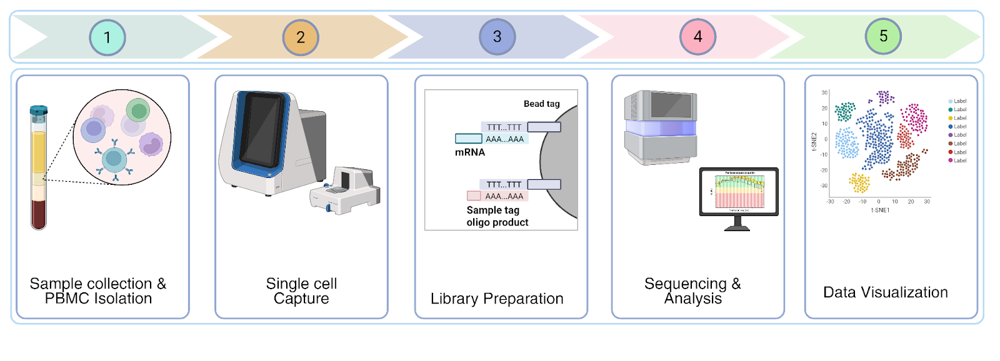
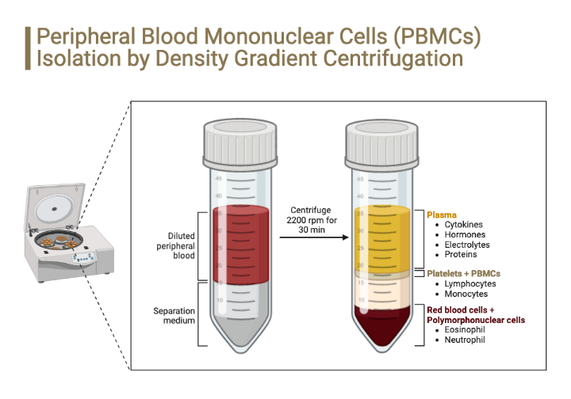
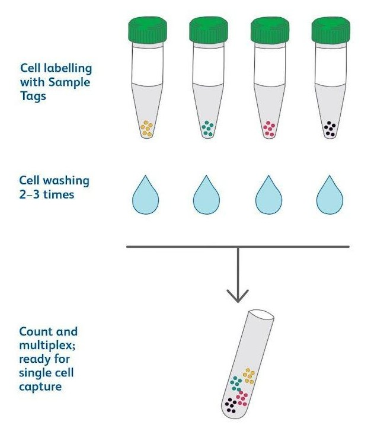
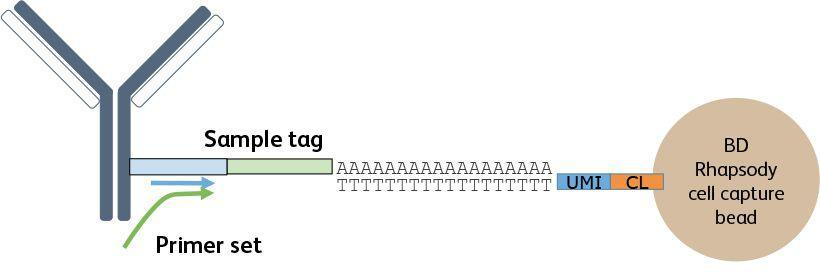
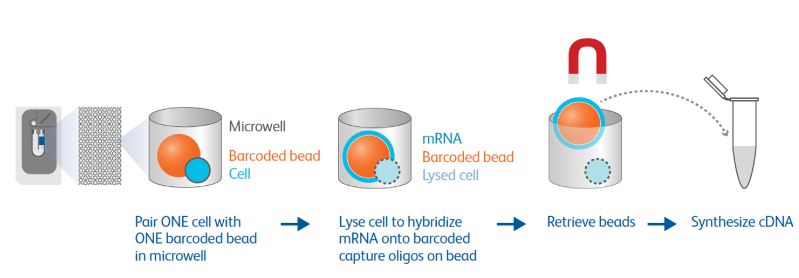

+-----------------------------------------------------------------------+
| # **Module 1 : PBMC Isolation and Single-Cell Capture**               |
+=======================================================================+
+-----------------------------------------------------------------------+

## **1. Single-Cell RNA Sequencing Overview **

Next-generation sequencing (NGS) platforms have rapidly improved in both
accuracy and throughput while becoming far more affordable. This shift
has transformed how we study gene expression, enabling deeper and more
comprehensive transcriptome profiling. Within transcriptomics, two
widely used NGS-based strategies are bulk RNA sequencing (bulk RNA-seq)
and single-cell RNA sequencing (scRNA-seq). Bulk RNA-seq measures the
combined gene expression of many cells together, producing an average
expression profile for a tissue or sample. In contrast, scRNA-seq
profiles gene expression in individual cells, providing an unprecedented
view into cellular diversity and allowing us to resolve complex tissues
into distinct cell types and states. scRNA-seq is a technology designed
to quantify the transcripts inside each cell in a sample. Because RNA
reflects genes that are actively being transcribed, scRNA-seq offers a
"snapshot" of the cellular transcriptome at the time the sample is
collected. Since the first scRNA-seq studies emerged around 2009 by Tang
et al., the field has progressed quickly, becoming a state-of-the-art
approach for mapping cell types, identifying rare populations, and
uncovering how different cells behave in health and disease. Instead of
treating a tissue as one blended signal, scRNA-seq reveals
heterogeneity; for example, how immune cells in the same organ can exist
in multiple functional states, or how small subsets of cells may drive
inflammation, recovery, or pathology.

At a practical level, scRNA-seq workflows convert biological signals
into a digital, cell-by-gene matrix that can be analysed
computationally. While protocols differ by platform, the core
experimental steps are broadly consistent: (1) isolate single cells, (2)
capture cells individually, (3) lyse cells and reverse transcribe RNA
into cDNA, (4) amplify cDNA, and (5) prepare sequencing-ready libraries.
One of the most important and labor-intensive stages is single-cell
isolation and capture, which can be achieved using methods such as FACS,
MACS, microfluidics-based capture (e.g., 10x Genomics), or microwell
systems (e.g., BD Rhapsody). High-throughput, tag-based platforms rely
on cell barcodes (to label which cell a transcript came from) and Unique
Molecular Identifiers (UMIs) (to label original molecules), enabling
digital transcript counting and reducing PCR amplification bias critical
for robust quantification.

scRNA-seq is powerful for infectious-disease research because it
resolves "host response" into distinct, cell-type--specific programs
rather than treating immunity as a single averaged signal: it can
reveal, for example, that ostensibly similar macrophages confronted with
bacteria diverge into different trajectories, some permissive to
microbial replication, others strongly microbicidal and clearing
infection, and others exhibiting weaker or alternative response states
insight that is central to understanding pathogenesis, separating
protective from pathological immune programs, and informing therapy.
Beyond profiling the host alone, scRNA-seq provides a single-cell
transcriptomic readout that can capture substantial transcriptomic
complexity (including isoform usage/alternative splicing signals,
low-abundance transcripts, and non-coding RNAs such as lncRNAs), and
with appropriate analytical frameworks the same datasets can be mined
for host--microbe interactions by assigning microbial transcript signals
to specific host cells and linking them to the host transcriptional
programs those cells activate. This "dual RNA-seq" concept at
single-cell resolution is particularly valuable for intracellular
pathogens, because it can connect infection status (which cells contain
microbial reads) with the host state changes infection induces,
effectively tying pathogen identity and host response together in one
measurement. A practical limitation is that many common scRNA-seq
chemistries rely on poly-A/oligo(dT) priming and therefore enrich
polyadenylated transcripts, so microbial detection varies by organism
and transcript features, but microbial reads can still be recovered in
many settings (especially when abundant or capture-compatible) and,
together with specialized pipelines, enable integrated analysis of
microbial diversity and host response. Finally, combining scRNA-seq with
multimodal single-cell methods such as scATAC-seq, CITE-seq, and V(D)J
profiling expands this into a broader toolkit for simultaneously
dissecting immune repertoires, regulatory landscapes, and cell-cell
communication during infection.

Microwell vs Droplet-Based Techniques:

Drop-seq and microwell-based single-cell platforms differ mainly in how
they isolate and barcode individual cells and what that implies for
handling, cell stress, capture efficiency, and workflow flexibility.
Drop-seq is a droplet-based microfluidic approach: cells and barcoded
beads are co-encapsulated into nanoliter droplets, enabling
high-throughput single-cell capture but relying on microfluidic channel
performance and exposing cells to higher shear stress than
gravity-settling methods. In contrast, microwell technology (illustrated
here using BD Rhapsody as an example) is gravity-based, loading cells
into an array of wells, where each cell is paired with a single barcoded
bead. Practically, microwell capture is often presented as more tolerant
of fragile cell types and less prone to "channel clogging" losses, with
reported high capture rates and relatively low multiplet rates across a
range of input loads. Finally, microwell workflows may offer added
experimental flexibility, such as sample multiplexing and an option
between whole-transcriptome and targeted gene panels (trading breadth
for lower sequencing depth/cost), whereas Drop-seq is typically
positioned as a broad, droplet-based whole-transcriptome method within
the droplet.

## 

## **2. PBMC Isolation Protocol from Blood**

**2.1 Introduction**

Peripheral blood mononuclear cells (PBMCs) are isolated from whole blood
using Histopaque density-gradient centrifugation to obtain a
high-quality, viable immune cell population suitable for single-cell
transcriptomic profiling. PBMC isolation enriches lymphocytes &
monocytes while removing erythrocytes & granulocytes, thereby minimizing
background noise & technical variability.

**Figure 1:** PBMCs Isolation by Density Gradient Centrifugation.

(Source:
[[anilocus.com/pbmc-isolation-and-cryopreservation-protocol]{.underline}](http://anilocus.com/pbmc-isolation-and-cryopreservation-protocol))

**2.2 Materials Required**

Sample (blood), 1X filtered PBS (phosphate buffer saline), Histopaque
media (density centrifugation media), filtered freezing media (90:10::
FBS: DMSO), 15 mL & 50 mL Falcon tubes, cryotubes, and 1.5 mL MCT
(microcentrifuge tubes). Here, FBS is Fetal Bovine Serum.

**2.3 Isolating PBMCs**

i.  Thaw 1X filtered PBS, Histopaque media, and freezing media
    > (filtered) at RT.

ii. Label the falcon with a sample name & ID, then transfer the 1 mL
    > blood to it.

iii. Add an equal volume of 1X filtered PBS to the labelled Falcon
     > containing blood. (Dilution 1:1)

iv. In the new Falcon, slowly add Histopaque media at a 1:1 ratio
    > (blood + PBS: Histopaque) (e.g., 1 mL blood + 1 mL PBS = 2 mL;
    > therefore, add 2 mL Histopaque).

v.  Carefully layer the diluted blood onto the Histopaque medium without
    > breaking the surface plane.

vi. Immediately, centrifuge the tubes at 400 x g, 20 min at RT
    > (deceleration rate = 0).

vii. After centrifugation, carefully remove the plasma layer & discard
     > it, then collect the PBMC layer from the periphery of the tube &
     > transfer it to a new 15 ml Falcon.

viii. Wash with 1X PBS 1-3 times & centrifuge at 250 x g for 10 minutes.

ix. Decant the supernatant & add 1 ml of freezing media to the PBMC
    > pellet & slowly mix with pipetting.

x.  Transfer the mix to 1.5 mL MCT and store it in a cryo-cooler at
    > -80°C.

xi. Later, transfer the cryopreserved PBMCs to liquid nitrogen (-196°C)
    > for future use.

**2.4 Preparing cryopreserved samples (PBMCs)**

i.  Gently swirl the cryovial in a 37°C water bath until the cells are
    > thawed (\~1--2 minutes) and transfer into a 15 mL falcon.

ii. Pipet 2 mL of warm 10% fetal bovine serum (FBS) media into a new
    > 15-mL conical tube.

iii. Centrifuge at 400 × g for 5 minutes & discard the supernatant, and
     > resuspend the cells in 0.5-1 mL of 10% FBS media by gentle
     > pipet-mix.

iv. Centrifuge at 400 × g for 5 minutes & discard the supernatant,
    > dissolve in 1 mL of 10% FBS, and strain the cells using Corning®
    > cell strainer 40 μm in a 50 mL Falcon

v.  Do a cell viability and count check using a cell counter. Keep the
    > rest of the samples at 37°C.

**2.5 Finding cell concentration on Countess 3**

i.  In 0.6 mL MCT, take 10 μL cell suspension & 10 μL trypan blue & mix
    > well.

ii. Load 10 μl of the mixture on the Countess chamber slide.

iii. Insert the cartridge in the cell counter & click on start.

iv. Note the cell concentration.

## 

## **3. Single Cell Labelling with the BD® Single-Cell Multiplexing Kits**

**3.1 Introduction**

The BD Human Single-Cell Multiplexing Kit utilizes an innovative
antibody-oligo technology to provide higher sample throughput for
single-cell library preparation. Every antibody-oligo in the BD Human
Single-Cell Multiplexing Kit, referred to as a Sample Tag, has a unique
sample oligo barcode conjugated to a human universal antibody. Up to 12
samples can be labelled & pooled before single-cell capture with the BD
Rhapsody Single-Cell Analysis system.

**3.2 Materials Required**

-   20,000-1 million cells, BD Pharmingen Stain Buffer (FBS), BD Human
    Single-Cell Multiplexing Kit, Never freeze Sample Tags, BD Rhapsody
    Cartridge Reagent Kit or BD Rhapsody Enhanced Cartridge Reagent Kit,
    5 mL polystyrene Falcon tube

**3.3 Labelling cells with Sample Tags**

i.  Resuspend 20,000-1 million cells in 200 µL BD Pharmingen Stain
    > Buffer

ii. Briefly centrifuge the Sample Tag tubes to collect the contents at
    > the bottom.

iii. For each sample, transfer 190 µL of cell suspension to a Sample Tag
     > tube

iv. Pipet-mix & incubate at RT for 20 minutes. Note down the Sample Tag
    > ID given to each sample.

v.  Prime the cell capture cartridge during this incubation

**3.4 Washing Labelled Cells**

i.  Transfer each labelled cell suspension to a 2.0 mL LoBind tube &
    > pipet 1 mL BD Pharmingen Stain Buffer into labelled cells &
    > pipet-mix.

ii. Centrifuge each tube at 400 x g for 5 minutes, and decant the
    > supernatant.

iii. Pipet 0.5 mL BD Pharmingen Stain Buffer (FBS) into each tube &
     > resuspend by pipet-mixing.

iv. Repeat steps ii-iii once more for a total of 2 washes. After the
    > final wash, resuspend in 1 mL of cold sample buffer.

v.  Recount the cells as described above and pool equal numbers of cells
    > from all samples.

vi. Add 3.1 μL of 2 mM Calcein AM and 3.1 μL of 0.3 mM DRAQ7 to 620 μL
    > of cell suspension (1:200) in the cold sample buffer. Incubate for
    > 5 min at RT.

vii. Strain the cells using Corning® cell strainer 40 μm in a 50 mL
     > Falcon

viii. Prepare the cell suspension for cartridge loading such that the
      > final concentration is \~25,000 cells in 620 µL of cold sample
      > buffer.

ix. Place the tube on ice & proceed to single-cell capture.

**Note:** Each Human Sample Tag is a human universal antibody conjugated
with a unique oligonucleotide sequence to allow for sample
identification. Each sample tag has common 5\' & 3\' ends. For more
details, follow:

[[https://www.bdbiosciences.com/content/dam/bdb/marketing-documents/DS-Rhapsody-SMK%20Label-RUO.pdf]{.underline}](https://www.bdbiosciences.com/content/dam/bdb/marketing-documents/DS-Rhapsody-SMK%20Label-RUO.pdf)

##  **4. Single-Cell Capture In a Microwell**

**4.1 Introduction**

(Shum et al., 2019)

Single-cell capture using the BD Rhapsody Single-Cell Analysis System
enables the analysis of gene expression at the resolution of individual
cells, allowing the study of cellular heterogeneity within complex
biological samples. In this method, a single-cell suspension is loaded
into a microwell-based cartridge where individual cells are isolated
into separate wells. Barcoded magnetic cell capture beads carrying
oligonucleotides with a cell-specific barcode, unique molecular
identifier (UMI), and poly(dT) sequence are introduced to pair with the
cells. Upon cell lysis, the released polyadenylated mRNA hybridizes to
the poly(dT) region on the beads. The

beads containing captured mRNA are then magnetically retrieved and
washed to remove impurities. Reverse transcription is performed directly
on the beads to synthesize complementary DNA (cDNA), preserving both
cell identity and transcript information.

**4.2 Priming and treating the BD Rhapsody Cartridge\
**

i.  Place the 5-mL LoBind tube in the Express instrument drawer.

ii. Set the Express instrument slider front to the 'Waste' and side to
    > '0' position.

  -----------------------------------------------------------------------------
  **Step   **Material to load**     **Volume   **P1200M Pipet    **Incubation
  no.**                             (µL)**     mode**            at RT**
  -------- ------------------------ ---------- ----------------- --------------
  **1.**   100% ethyl alcohol       700        Prime/Treat       ---

  **2.**   Air                      700        Prime/Treat       ---

  **3.**   (RT) Cartridge Wash      700        Prime/Treat       1 min
           Buffer 1                                              

  **4.**   Air                      700        Prime/Treat       ---

  **5.**   (RT) Cartridge Wash      700        Prime/Treat       10 min
           Buffer 1                                              

  **6.**   Air                      700        Prime/Treat       ---

  **7.**   (RT) Cartridge Wash      700        Prime/Treat       ≤4hr
           Buffer 2                                              
  -----------------------------------------------------------------------------

**4.3 Counting and preparing a single-cell suspension for cartridge
loading**

We need \~25000 cells for the loading, which can be calculated using the
formula:

Volume to Load = [Total cells desired to load]{.underline}

> Concentration of suspension
>
> (cell/µL)

Since we need the total cells desired to load = \~ 25000 cells.
Calculate the volume to load.

**4.4 Loading cells in the cartridge**

i.  Load the cartridge with materials listed using the P1200M Pipet:

+--------------------------+------------------+------------------------+
| **Material to load**     | **Volume (µL)**  | **Pipet mode**         |
+==========================+==================+========================+
| **Air**                  | 700              | Prime Treat            |
+--------------------------+------------------+------------------------+
| • Set the P1200M Pipet   |                  |                        |
| to **Cell Load mode**.   |                  |                        |
|                          |                  |                        |
| • Pipet-mix the cell     |                  |                        |
| suspension with a manual |                  |                        |
| P1000 pipet.             |                  |                        |
+--------------------------+------------------+------------------------+
| **Cell suspension**      | 575              | Cell Load              |
+--------------------------+------------------+------------------------+

ii. **Cell Load mode:** Press once to aspirate **40 µL air**. Insert the
    > tip into the cell suspension and press again to aspirate 575 µL
    > cold suspension. Dispense the total 615 µL (air + suspension) into
    > the cartridge.

iii. Incubate at RT for 15 minutes inside the scanner and "Start cell
     > load scan."

**Note:** *During the 15-minute incubation, prepare the Cell Capture
Beads or BD Rhapsody Enhanced Cell Capture Beads.*

**4.5 Preparing cell capture beads\
**

i.  Place the Cell Capture Bead tube on the magnet for 1 minute, and
    > remove the storage buffer.

ii. Remove the tube from the magnet, and pipette 750 µL of cold sample
    > buffer into the tube. Pipette-mix, and place on ice.

**4.6 Loading and washing Cell Capture Beads**

i.  Set the P1200M Pipet to Prime/Treat mode.

ii. Load the cartridge with the following materials using the P1200M
    > Pipet:

+------------------------+---------------------+-----------------------+
| **Material to load**   | **Volume (µL)**     | **Pipet mode**        |
+========================+=====================+=======================+
| **Air**                | 700                 | Primer/Treat          |
+------------------------+---------------------+-----------------------+
| •Set P1200M Pipet to   |                     |                       |
| bead load mode.        |                     |                       |
|                        |                     |                       |
| •Use a manual P1000 to |                     |                       |
| gently pipet-mix the   |                     |                       |
| beads in a cold sample |                     |                       |
| buffer. Immediately    |                     |                       |
| load.                  |                     |                       |
+------------------------+---------------------+-----------------------+
| **Cell Capture Beads** | 630                 | Bead Load             |
+------------------------+---------------------+-----------------------+

iii. Incubate the cartridge at RT for 3 minutes. Perform the "Bead Scan"
     > scanner step.

iv. After Incubation Load cartridge with materials listed using the
    > P1200M Pipet to Wash mode:

  -----------------------------------------------------------------------
  **Material to load**             **Volume (µL)**       **Pipet mode**
  -------------------------------- --------------------- ----------------
  **Air**                          700                   Wash

  **Cold Sample Buffer**           700                   Wash

  **Air**                          700                   Wash

  **Cold Sample Buffer**           700                   Wash
  -----------------------------------------------------------------------

**4.7 Lysing cells**

> Avoid bubbles during all pipetting steps:

i.  Add 75.0 µL of 1 M DTT to one 15-mL bottle of lysis buffer to
    > prepare a fresh lysis buffer with DTT.

ii. Use the prepared lysis buffer with DTT within 24 hours and discard
    > any remaining buffer after this time.

iii. Briefly vortex the lysis buffer with DTT to mix well and place it
     > on ice until use.

iv. Move the left slider on the Express instrument to the ***LYSIS***
    > position.

v.  Set the P1200M Pipet to ***Lysis* mode.**

  ------------------------------------------------------------------------
  **Material to load**            **Volume (µL)**      **Pipet mode**
  ------------------------------- -------------------- -------------------
  Lysis Buffer **with DTT**       550                  Lysis

  ------------------------------------------------------------------------

vi. Load the cartridge using the P1200M Pipet as described in the table
    > below:Incubate the cartridge at RT for **2 minutes**.

vii. Maintain the recommended lysis time strictly to ensure optimal
     > performance and efficient cell lysis. Immediately proceed for
     > next steps.

**4.8 Retrieving Cell Capture Beads**

i.  Place the 5-mL LoBind tube in the Express instrument drawer.

ii. Set the P5000M Pipet to retrieval mode before.

iii. Move the front slider to **BEADS** and the left slider to
     > **RETRIEVAL**.

iv. Keep the **retrieval magnet down for 30 seconds** for proper bead
    > positioning.

v.  Aspirate 5,000 µL of lysis buffer with DTT using the P5000M.

vi. Press the Pipet firmly against the gasket to form a tight seal.

vii. Move the **left slider to the middle (0)** position and
     > **immediately dispense 4,950 µL into the cartridge.**

viii. Remove the Pipet and purge the tip to clear residual liquid.

ix. Move the front slider to OPEN and place the 5-mL LoBind tube on the
    > large magnet with 15-mL adapter for 1 minute. Immediately proceed
    > to the cell capture bead washing steps.

x.  Dispose of the used cartridge, waste container, and Lysis Buffer
    > with DTT according to biological waste guidelines.

xi. Clean the Express instrument with 10% bleach or 70% ethanol after
    > completion.

**4.9 Washing Cell Capture Beads**

i.  After 1-minute incubation, keep the 5-mL tube containing Cell
    > Capture Beads on the large magnet and carefully remove the
    > supernatant, leaving \~1 mL to avoid disturbing the beads.

ii. Remove tube from magnet, gently pipet-mix, and transfer beads to a
    > new 1.5-mL LoBind tube.

iii. If beads remain, rinse the 5-mL tube with 0.5 mL lysis buffer with
     > DTT and transfer to the same 1.5-mL tube.

iv. Place the 1.5-mL tube on a magnetic rack for ≤2 minutes and remove
    > the supernatant.

v.  Ensure no residual lysis buffer or air bubbles remain (may interfere
    > with reverse transcription).

vi. Remove from magnet, add 1.0 mL cold Bead Wash Buffer, and gently
    > pipet-mix to resuspend.

vii. Place the tube back on the magnet for ≤2 minutes and remove the
     > supernatant.

viii. Remove from the magnet, add another 1.0 mL cold Bead Wash Buffer,
      > gently pipet-mix, and place on ice.

ix. Start reverse transcription within 30 minutes of bead washing for
    > optimal efficiency.

**4.10 Performing reverse transcription (cDNA synthesis)**

i.  Confirm that the SmartBlock Thermoblock for ThermoMixer C is
    > preheated to 37°C before starting.

ii. In the pre-amplification workspace, prepare the cDNA mix in a new
    > 1.5-mL LoBind tube kept on ice.

iii. Add the required volumes of RT Buffer, dNTPs, DTT, Bead RT/PCR
     > Enhancer, RNase Inhibitor, Reverse Transcriptase, and
     > nuclease-free water according to the number of libraries being
     > prepared.

  -----------------------------------------------------------------------
  **Component**                   **For 1 library + 10% overage (uL)**
  ------------------------------- ---------------------------------------
  **RT Buffer**                   44

  **dNTP**                        22

  **RT 0.1 M DTT**                11

  **Bead RT/PCR Enhancer**        13.2

  **RNase Inhibitor**             11

  **Reverse Transcriptase**       11

  **Nuclease-Free Water**         107.8

  **Total**                       220
  -----------------------------------------------------------------------

iv. Gently vortex the cDNA mix to ensure proper mixing, briefly
    > centrifuge to collect the contents, and place the tube back on
    > ice.

v.  Place the tube containing washed Cell Capture Beads on a 1.5-mL
    > magnetic rack for no longer than 2 minutes and carefully remove
    > the supernatant.

vi. Remove the tube from the magnet and add 200 µL of the prepared cDNA
    > mix to the beads, then pipet-mix gently to resuspend the beads.

vii. Keep the bead cDNA mix on ice until it is ready to be transferred
     > to the next tube.

viii. Transfer the bead suspension to a new 1.5-mL LoBind tube.

ix. Incubate the bead suspension on the ThermoMixer at 37°C with shaking
    > at 1,200 rpm for 20 minutes; continuous shaking is critical for
    > efficient reverse transcription.

x.  Immediately place the tube on ice after incubation to stop the
    > reaction.

**4.11 Treating the sample with Exonuclease I**

i.  Set one thermomixer to 37°C and a second thermomixer to 80°C.

> ***Note:** Do not use a heat block for the 80°C incubation, as
> temperatures above 80°C can cause AbSeq molecule loss. If only one
> thermomixer is available, pre-equilibrate it to 80°C before starting
> the inactivation step.*

ii. In the pre-amplification workspace, prepare the Exonuclease I mix in
    > a new 1.5-mL LoBind tube placed on ice. Gently vortex the mix,
    > briefly centrifuge, and place the tube back on ice.

iii. Place the tube containing Cell Capture Beads with cDNA on a 1.5-mL
     > tube magnet for ≤ 2 minutes. Remove and discard the supernatant.

iv. Remove the tube from the magnet and add 200 µL of Exonuclease I mix.
    > Mix by pipetting.

v.  Incubate the bead suspension on the thermomixer at 37°C, 1,200 rpm,
    > for 30 minutes.\
    > \
    > **Note:** *If only one thermomixer is available, allow it to
    > equilibrate to 80°C. Keep samples on ice until the temperature is
    > reached.\
    > *

vi. Incubate the bead suspension on the thermomixer at 80°C for 20
    > minutes with no shaking.\
    > \
    > **Note:** *Do not exceed the specified temperature or incubation
    > time.\
    > *

vii. Place the tube on ice for approximately 1 minute.

viii. Place the tube on the magnet for ≤ 1 minute until the solution
      > becomes clear. Remove and discard the supernatant.

ix. Remove the tube from the magnet and add 200 µL of cold Bead
    > Resuspension Buffer. Mix by pipetting.

> **Note:** *Stopping point: Exonuclease I--treated beads may be stored
> at 2--8°C for up to 3 months.*

x.  Proceed to library preparation according to the Single-Cell Analysis
    > Workflow with BD Rhapsody Systems.
