  -----------------------------------------------------------------------
  **Module 5: Single-Cell RNASeq Analysis**
  -----------------------------------------------------------------------

  -----------------------------------------------------------------------

1.  **Basic Workflow**

> 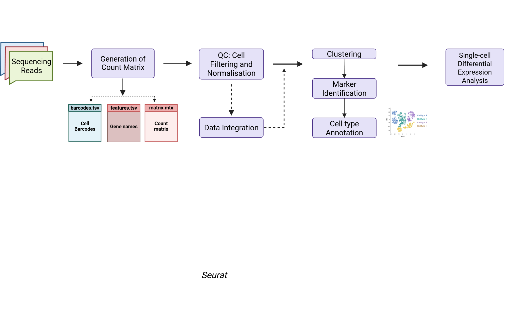

After quantification of the gene expression, we obtain three matrices
which need to be imported into the R environment for further QC steps
which includes cell filtering, clustering, marker identification and
cell annotation.

2.  **Metadata**

For this tutorial we will be using Peripheral Blood Mononuclear Cells
(PBMCs) samples collected from four individuals during COVID-19 pandemic
and are classified into following groupings:

-   Healthy : 2 samples (b14st04, b14st05)

-   Infected : 2 samples (b08st05 and b08st06)

3.  **Setting up the R environment**

**3.1 Install R and RStudio (Windows)**

-   Install the most recent version of R and RStudio on your laptop:

-   R ([[https://cran.rstudio.com/bin/windows/]](https://cran.rstudio.com/bin/windows/))

-   RStudio ([[https://posit.co/download/rstudio-desktop/]](https://posit.co/download/rstudio-desktop/))

**3.2 Install R packages**

Open RStudio and install the following packages listed below one by one.

**Note:**

-   Install the packages in the order listed below.

-   When installing the following packages, if you are asked to select  (a/s/n) or (y/n), please select "a" or \"y\" as applicable.

-   All the package names listed below are case sensitive!

```r
#Install required packages

 install.packages("tidyverse")                                                                                                             
 install.packages("Matrix")                                                                                                             
 install.packages("RCurl")                                                                                                                  
 install.packages("scales")                                                                                                                 
 install.packages("cowplot")                                                                                                                
 install.packages("devtools")                                                                                                               
 install.packages("BiocManager")                                                                                                            
 install.packages("Seurat")                                                                                                                 
 BiocManager::install("DESeq2")                                      
```

**3.3 Set up working directory and download sample count matrix**

-   Open New R script and set the working directory using setwd() command:

```r
 #Set working directory                                                
                                                                       
 setwd("path/to/working/directory/")                                   
                                                                       
 #Check if it has changed to desired path                              
                                                                       
 getwd()                                                               
```


-   Save the R script as Single_Cell_RNASeq_Analysis.R : **File \>Save**

-   Download data in the same directory using the following link:
    > [[https://drive.google.com/drive/folders/1wVBsd5x6BTrvi6048EQLo1U_xfXjIWh1?usp=sharing]](https://drive.google.com/drive/folders/1wVBsd5x6BTrvi6048EQLo1U_xfXjIWh1?usp=sharing)

-   Your working directory should look like this:

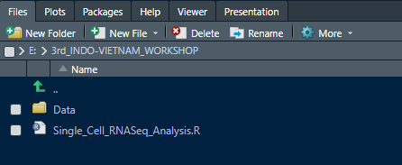

**3.4 Load R packages using library() function**

```r
#Load libraries
library(Seurat)                                                       
library(tidyverse)                                                                                                                    
library(Matrix)                                                      
library(RCurl)                                                       
library(scales)                                                      
library(cowplot)                                                     
```

4.  **Loading Single-Cell RNA-Seq Count Data**

After quantification, we obtain three files for each sample irrespective
of the pipeline used for the processing of single-cell RNA-seq
sequencing data which are as follows:

-   **barcodes.tsv -** Text file containing all the cell barcodes for that sample.

-   **features.tsv -** Text file containing the gene id and gene symbols. The order of these genes corresponds to the order of rows in matrix.mtx.

-   **matrix.mtx -** Text file containing the count value matrix where geneIDs are specified by rows and cell barcodes are specified by columns.

We can see them inside 3rd_INDO_VIETNAM_WORKSHOP/Data/b08st05/
folder: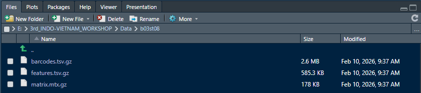

These files can be read into R using various functions including:

-   **readMM( )** : This function from the Matrix package loads individual matrices and then combines them to form a sparse matrix.

-   **Read10X( )** : This function from the Seurat package uses the sample directory as input instead of individual matrices and then combines them into a sparse matrix for you.

*We will be using the read10X( ) function to load in our data.*

-   Reading single-sample

```r
 #Read in sample directory to create sparse matrix                     
                                                                       
 seurat_data <- read10X("data.dir = Data/b08st05")                     
                                                                       
 # Creating the Seurat object                                         
                                                                       
 seurat_obj <- CreateSeuratObject(counts = seurat_data, min.features  = 100)                                                                
```

-   Reading into multiple samples using for loop

```r
 #set working directory                                                
                                                                       
 setwd("E:/3rd_INDO-VIETNAM_WORKSHOP/Data/")                           
                                                                       
 #Looping through each sample directory to create a final Seurat object                                                                
                                                                       
 for (file in c("b08st05", "b08st06","b14st04","b14st05")){                                                                        
    seurat_data <- Read10X(data.dir = file))                             
    seurat_obj <- CreateSeuratObject(counts = seurat_data,               
                                      min.features = 100,                                                   
                                      project = file)                                                       
    assign(file, seurat_obj)                                                                                                                  
 }                                                                     
                                                                       
 head(seurat_obj@meta.data)                                            
```

**Note:** *The min.features argument specifies the minimum number of
genes that need to be detected per cell.*

```r
                orig.ident nCount_RNA nFeature_RNA                                                                                             
 b08st05_AAGACATGC_ACTTCGAGC_AAAGAGGCC AAGACATGC 553 148                                                                        
 b08st05_CTACAGAAC_CACAAAGGC_AAAGAGGCC CTACAGAAC 964 381                                                                           
 b08st05_ATCTCCACA_CACCTACCC_AAAGAGGCC ATCTCCACA 3633 1417                                                                         
 b08st05_CCTGAGCAA_AATCCTGAA_AAAGTCATT CCTGAGCAA 234 124                                                                           
 b08st05_ATTATTACC_ACGCGAAGC_AAAGTCATT ATTATTACC 147 117                                                                          
 b08st05_TCAGGAGGA_GACCTTAGA_AAAGTCATT TCAGGAGGA 295 101      
```

Notice that the orig.ident column contains the first 9 nucleotide
sequence from the UMI tag instead it should contain the original sample
identity. Assign sample identity to orig.ident manually using the
following command:

```r

 #Manually assign orig.ident                                           
 b08st05$orig.ident <- "b08st05"                                                                           
 b08st06$orig.ident <- "b08st06"                                                                                                     
 b14st04$orig.ident <- "b14st04"                                                                                                       
 b14st05$orig.ident <- "b14st05"                                   
                                                                       
 #Merge individual seurat object into one large object                 
                                                                       
 merged_seurat <- merge(x = b08st05, 
                        y = list(b08st06,b14st04,b14st05),
                        add.cell.ids = c("b08st05", "b08st06","b14st04","b14st05"))                                 
```

After creating the seurat object the Global R environment will look
something like this:

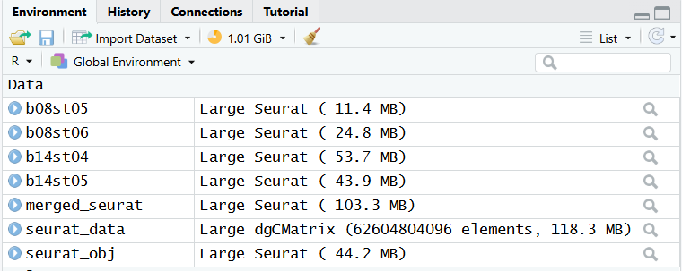

Let's have a quick look at our metadata:

```r
  head(merged_seurat@meta.data)
```


```r
                                orig.ident nCount_RNA nFeature_RNA                                                                            
b08st05_AAGACATGC_ACTTCGAGC_AAAGAGGCC b08st05     553          148                                                                          
b08st05_CTACAGAAC_CACAAAGGC_AAAGAGGCC b08st05     964          381                                                                             
b08st05_ATCTCCACA_CACCTACCC_AAAGAGGCC b08st05     3633        1417                                                                           
b08st05_CCTGAGCAA_AATCCTGAA_AAAGTCATT b08st05     234          124                                                                             
b08st05_ATTATTACC_ACGCGAAGC_AAAGTCATT b08st05     147          117        
```

Do you know what these columns of metadata signifies ?

-   orig.ident : It is the original identity of the cell.

-   nCount_RNA: It is the total number of UMIs detected in each cell.

-   nFeature_RNA: It is the total number of unique genes detected in each cell.

**Note**: *We can see that the droplet/cell ids, given in the row names
of this table, have prefixes added (based on the add.cell.ids option we
used above with the merge() function).*

The other important slot of Seurat Object is \@assays which stores the
raw count matrix, as well as downstream normalised/transformed data. We
can see that currently it has only the count data, called \$RNA.

```r
  merged_seurat@assays
```
```r
 $RNA                                                        
 Assay (v5) data with 70761 features for 12260 cells       
 First 10 features:DDX11L2, DDX11L1, WASH7P, MIR6859-1, MIR1302-2HG, MIR1302-2,         
 FAM138A, OR4G4P, ENSG00000290826, OR4G11P                                                
                                                                       
 Layers:                                                    
                                                                       
 counts.b08st05, counts.b08st06, counts.b14st04,counts.b14st05                                             
```

5.  **Data QC: Filtering Cells using quality metrics**

In this step we will filter out cells with high mitochondrial reads
(>20%) which is indicative of poor cell quality.

**5.1. Presence of Mitochondrial Reads**

Seurat provides an inbuilt function PercentageFeatureSet() to calculate
the percentage of reads mapping to mitochondrial genes.

 ```r
  merged_seurat[["percent.mt"]] <- PercentageFeatureSet(merged_seurat, pattern = "^MT-")
```

```r
 orig.ident nCount_RNA nFeature_RNA percent.mt
                                                                       
 b08st05_AAGACATGC_ACTTCGAGC_AAAGAGGCC b08st05 553 148   68.53526                                                                
 b08st05_CTACAGAAC_CACAAAGGC_AAAGAGGCC b08st05 964 381   40.24896                    
 b08st05_ATCTCCACA_CACCTACCC_AAAGAGGCC b08st05 3633 1417 13.07459                                                                             
 b08st05_CCTGAGCAA_AATCCTGAA_AAAGTCATT b08st05 234 124   37.60684                                                                             
 b08st05_ATTATTACC_ACGCGAAGC_AAAGTCATT b08st05 147 117   14.28571                                                                             
 b08st05_TCAGGAGGA_GACCTTAGA_AAAGTCATT b08st05 295 101   45.08475                                                     
```

**5.2 Visualising Counts**

```r
 #Visualize number of genes per cell                                   
                                                                       
 VlnPlot(merged_seurat, features = "nFeature_RNA", group.by = "orig.ident")                                                       
```

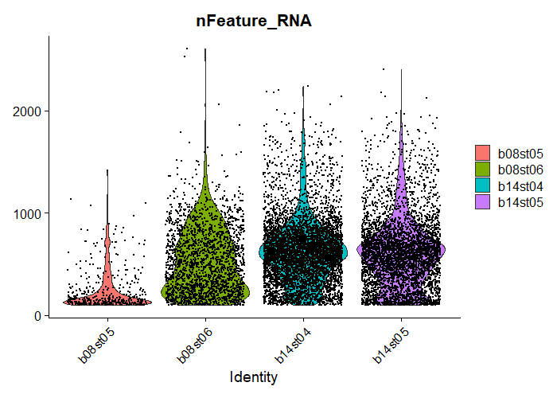

```r
 #Visualize number of reads per cell                                   
                                                                       
 VlnPlot(merged_seurat, features = "nCount_RNA", group.by = "orig.ident")                                                       
```

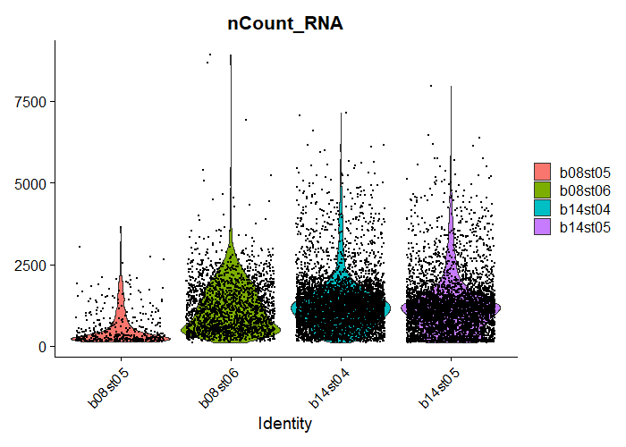

```r
 #Visualise percentage of mitochondrial reads per cell              
                                                                    
 VlnPlot(merged_seurat, features = "percent.mt", group.by = "orig.ident")                                                       
```

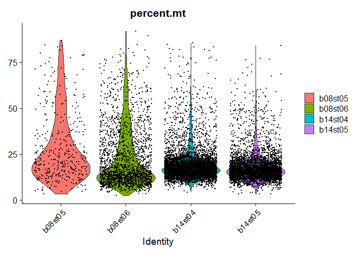

**5.3 Filtering Cells**

Based on the QC metrics, it is important to filter low quality cells
before moving to the next step. So, let's look at the relationships
between the QC metrics:

```r
 #To visualize the relationship between total reads per cell and mitochondrial reads percentage                                        
                                                                       
 FeatureScatter(merged_seurat, feature1 = "nCount_RNA", 
                               feature2 ="percent.mt", 
                               group.by = "orig.ident")                            
```

Notice that the cells with high percent.mt also have very low read
counts which is indicative of the low quality cells and will be filtered
out. 

```r
# To visualize the relationship between total reads per cell and total features (genes) per cell                                     
                                                                     
 FeatureScatter(merged_seurat, feature1 = "nCount_RNA", feature2 = "nFeature_RNA", group.by = "orig.ident")                          
```

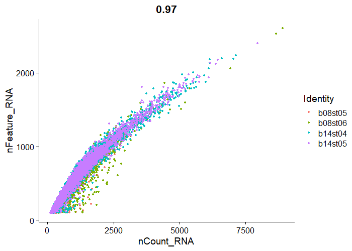

In the above graph it shows a strong positive correlation of total reads
with the total genes. Would you expect that ? The answer is yes. It
reflects the capture of diverse RNA molecules in our dataset.

After looking at the QC metrics we will use some thresholds to filter
out outlier cells:

-   nFeature_RNA(No. of genes/cell) > 100 (exclude poor quality cells)

-   nFeature_RNA < 2500 (exclude doublets)

-   percent.mt (mitochondrial reads percentage/cell) < 20%(exclude non-viable cells)

```r
 #define condition for filtering                                       
                                                                       
 cells_to_filter <- rownames(subset(merged_seurat, 
 subset = nFeature_RNA > 100 & nFeature_RNA < 2500 & percent.mt <20)@meta.data)
                                                                       
 # add this information to the metadata                               
                                                                       
 merged_seurat$keep <-rownames(merged_seurat@meta.data) %in% cells_to_filter                                                       
```

Let us quickly see the number of cells we are retaining:

```r
  table(merged_seurat\$keep)
```
```r
#Output:

 FALSE TRUE                                                                                                                              
 3743 8517                                                             
```


Here, a total of 3743 cells did not pass the filter and will be removed
from further analysis.

```r
#Remove cells with keep = FALSE                                       
                                                                      
merged_seurat <- subset(merged_seurat, subset = keep)                                                                    
merged_seurat                                                        
```
```r
#Output:

 An object of class Seurat                                                                                                                 
 70761 features across 8517 samples within 1 assay                                                                                       
 Active assay: RNA (70761 features, 0 variable features)                                                                                  
 4 layers present: counts.b08st05, counts.b08st06, counts.b14st04, counts.b14st05                                                        
```

**5.4 Data Normalisation**

After getting our high quality cells it is important to normalize our
data before cell clustering for accurate comparisons between cells.

```r
 #Install glmGamPoi for faster estimation                              
                                                                       
 BiocManager::install('glmGamPoi')                                   
                                                                       
 #Normalize data using SCtransform()                                   
                                                                       
 merged_seurat <- SCTransform(merged_seurat,                          
                              vars.to.regress = "percent.mt",                                     
                              variable.features.n = 3000)                                           
```

**Note:** *variable.features.n takes the top variable features(genes).*

```r
#Output:

  An object of class Seurat                                                                    
  84847 features across 8517 samples within 2 assays                    
  Active assay: SCT (14086 features, 3000 variable features)            
  3 layers present: counts, data, scale.data    
  1 other assay present: RNA                                            
```

The normalised data is stored under \$SCT in the assay slot.

```r
  merged_seurat@assays
```
```r
#Output:

 $RNA                                                                                                                                  
 Assay (v5) data with 70761 features for 8517 cells                                                                                   
 First 10 features: DDX11L2, DDX11L1, WASH7P, MIR6859-1, MIR1302-2HG, MIR1302-2, FAM138A, 
 OR4G4P, ENSG00000290826, OR4G11P                                                                                                           
 Layers:counts.b08st05, counts.b08st06, counts.b14st04, counts.b14st05        
                                                                       
 $SCT                                                                                                                                     
 SCTAssay data with 14086 features for 8517 cells, and 4 SCTModel(s)                                                                     
 Top 10 variable features:                                                                 
 LYZ, CD74, CXCL8, GNLY, MALAT1, FTH1, C5AR1, S100A8, IGKC, IL1B       
```

**5.5 Dimensionality Reduction**

**5.5.1 Linear Dimension Reduction (PCA)**

PCA stands for Principal Component Analysis which is used to reduce the
dimension of large datasets as in single-cell data where thousands of
cells are pointing towards thousands of features making it a high
multidimensional space.

 ```r
  merged_seurat <- RunPCA(merged_seurat, features = VariableFeatures(object = merged_seurat))
```

```r
|$pca                                                                                                                                   
 A dimensional reduction object with key PC                                                                                          
 Number of dimensions: 50                                                                                                                 
 Number of cells: 8517                                                                                                                    
 Projected dimensional reduction calculated: FALSE                                                                                        
 Jackstraw run: FALSE                                                                                                                     
 Computed using assay: SCT                                             
```

Let us visualize the PCA plot using DimPlot function:

```r
  DimPlot(merged_seurat, reduction = "pca", group.by="orig.ident")
```

> 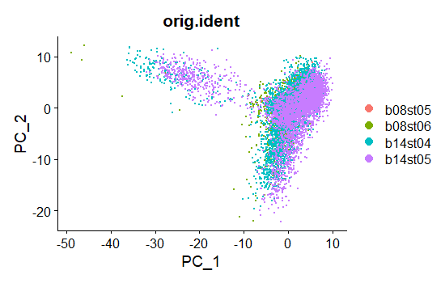

Seurat clusters cells based on the top variable principal components and
hence represent a robust compression of the dataset. The next question
is how many components should we choose to include? One of the methods
to determine the dimensions is using the ElbowPlot() function which
ranks principal components based on the percentage of variance explained
by each one. In the graph below we can see the Elbow at around PC 10,
suggesting that the majority of true signal is captured in the first 10
PCs.

**Note:** *We later used these dimensions (1:10) to cluster the cells.*

```r
  ElbowPlot(merged_seurat)
```
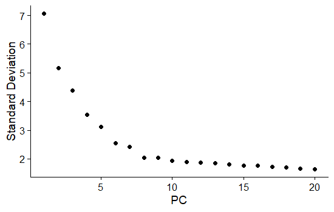

**5.5.2 Non-Linear Dimensionality Reduction (UMAP/tSNE)**

Non-linear dimensionality reduction techniques like UMAP and t-SNE
typically begin with PCA-transformed data, but they go further by
capturing complex, non-linear structures within the dataset. This allows
them to project high-dimensional patterns into two dimensions, making
the results easier for humans to visualize and interpret.

We will run UMAP and tSNE using the number of dimensions chosen before
from Elbowplot i.e. 10.


```r
 #Run UMAP                                                             
                                                                       
 merged_seurat <- RunUMAP(merged_seurat, dims = 1:10)                 
                                                                       
 #Run tSNE                                                             
                                                                       
 merged_seurat <- RunTSNE(merged_seurat, dims = 1:10)                 
                                                                       
 merged_seurat@reductions                                              
```

```r
#Output:

$pca                                                                                                                                      
A dimensional reduction object with key PC                                                                      
Number of dimensions: 50                                                                                                                    Number of cells: 8517                                                                                                                    
Projected dimensional reduction calculated: FALSE                                                                                           Jackstraw run: FALSE                                                  
Computed using assay: SCT                                             
                                                                       
$umap                                                                                                                                     
A dimensional reduction object with key umap\_                                                                                               
Number of dimensions: 2                                               
Number of cells: 8517                                                 
Projected dimensional reduction calculated: FALSE                     
Jackstraw run: FALSE                                                  
Computed using assay: SCT                                             
                                                                       
$tsne                                                                
A dimensional reduction object with key tSNE\_                        
Number of dimensions: 2                                               
Number of cells: 8517                                                 
Projected dimensional reduction calculated: FALSE                     
Jackstraw run: FALSE                                                  
Computed using assay: SCT                                             
```

Notice that PCA has 50 dimensions while UMAP and tSNE have only two
dimensions.

Let us have a look at the UMAP and tSNE plots:

```r
 #Plot UMAP                                                            
                                                                       
 DimPlot(merged_seurat, group.by = "orig.ident", reduction = "umap")                                                             
                                                                       
 #Plot tSNE                                                            
                                                                       
 DimPlot(merged_seurat, group.by = "orig.ident", reduction ="tsne")                                                             
```

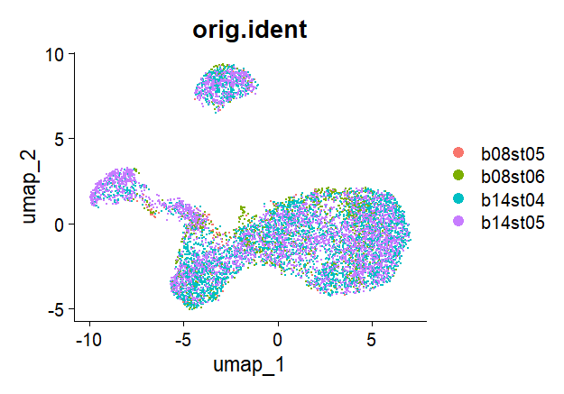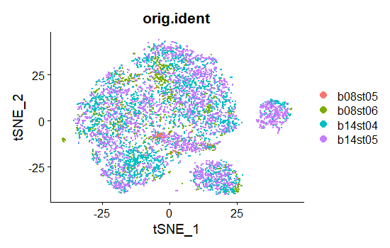

**Note:** *To visualise UMAP for each of the sample use split.by =
"orig.ident" in DimPlot()*

```r
 #Visualize UMAP for each sample separately                            
                                                                       
 DimPlot(merged_seurat, group.by = "orig.ident", split.by = "orig.ident", reduction = "umap")                                 
```

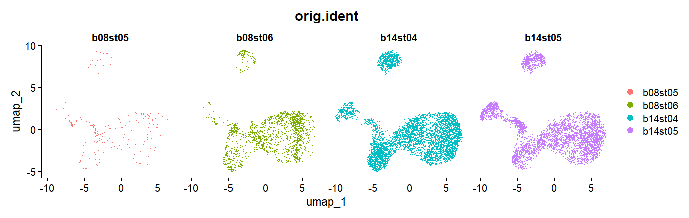

In the above UMAP we can see that all the samples are completely
overlapping with each other which indicates that there is no batch
effect in our dataset. In case there is a batch effect, we need to do
batch correction before going for clustering using a method known as
*data integration.*

**5.6 Data Integration**

Data integration is a Seurat function which aims at bringing cells of
different samples closer to each other while retaining the biological
variance.

Firstly, we will normalize each sample independently and save them as a
list of normalised Seurat objects.

```r
 #Loop through each sample to normalize                                
                                                                       
 split_seurat <- lapply(split_seurat, function(x) {  
   SCTransform(x, verbose = FALSE)                                       |
 })   

# Then select features that are repeatedly variable across datasets  
                                                                       
 integ_features <- SelectIntegrationFeatures(                                                                                               
 object.list = split_seurat,                                                                                                                 
 nfeatures = 3000                                                                                                                            
 )                                                                     
                                                                       
# Prep integration                                                   
                                                                       
split_seurat <- PrepSCTIntegration(                                  
object.list = split_seurat,                                           
anchor.features = integ_features                                                                                                            
)                                                                     
                                                                       
#Perform Integration                                                                                                                      
integ_anchors <- FindIntegrationAnchors(object.list = split_seurat,                                                            
 normalization.method = "SCT",                                                                                                      
 anchor.features = integ_features)  

 seurat_integrated <- IntegrateData(anchorset = integ_anchors,     
                                    normalization.method = "SCT")                                       
                                                                       
 seurat_integrated@assays                                              
```

```r
#Output:

 $RNA                                                                                                                                    
 Assay (v5) data with 70761 features for 8517 cells                                                                                        
 First 10 features:                                                                                                                         
 DDX11L2, DDX11L1, WASH7P, MIR6859-1, MIR1302-2HG, MIR1302-2, FAM138A, 
 OR4G4P, ENSG00000290826, OR4G11P                                                                                                           
 Layers: counts.b08st05.1, counts.b08st06.2, counts.b14st04.3, counts.b14st05.4                                                      
                                                                       
 $SCT                                                                                                                                      
 SCTAssay data with 14086 features for 8517 cells, and 4 SCTModel(s)                                                                        
 First 10 features: MTND2P28, MTATP6P1, CCNL2, SSU72, GNB1, SKI, RER1, KCNAB2,            
 ENSG00000285629, RPL22                                                
                                                                       
 $integrated                                                                                                                              
 SCTAssay data with 2678 features for 8517 cells, and 1 SCTModel(s)                                                                     
 Top 10 variable features: CD74, GNLY, MALAT1, FTH1, NEAT1, KCNQ1OT1, NKG7, TALAM1, VIM, KLRB1   
```

We can now save Seurat object at this stage into an rds file.

```r
 #Save Integrated seurat object                                        
                                                                       
 saveRDS(seurat_integrated, "E:/3rd_INDO-VIETNAM_WORKSHOP/Results/integrated_seurat.rds")       
```

**# We will skip the data integration step for this tutorial as our
dataset does not have batch effects.**

6.  **Cell Clustering**

After following all QC and dimensionality reduction steps, we will group
transcriptionally similar cells into clusters. These clusters can
represent similar cell types, cell states or transitional cell
populations. It helps us to identify rare cell types. Cell clustering
mainly includes two steps:

-   FindNeighbors():It constructs a **K-Nearest Neighbor (KNN) graph** of cells using the reduced dimensional space (usually PCA). It extracts the PCs (in our case dims = 1:10 i.e. PC1-PC10) for every cell and identifies the K nearest neighbors (default k = 20) to construct the Shared Nearest Neighbor (SNN) graph.

-   FindClusters(): It detects communities in the SNN graph created by FindNeighbors(). You can control cluster granularity using resolution argument ( higher resolution means more clusters and vice-versa). You can also choose the algorithm to perform community detection using algorithm argument. Seurat provides four such algorithms which are as follows:

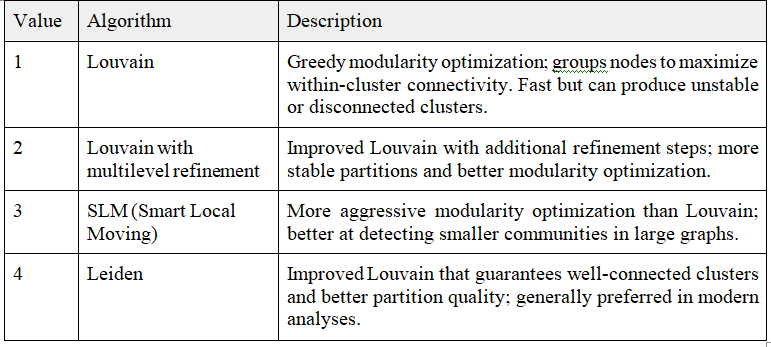

**Note:** *Choosing the right resolution in Seurat is about finding a
balance between biological meaning and clustering stability. In
practice, you test a range of values (for example, 0.4--1.2) and look
for a level where known cell types separate clearly without being split
into unnecessary subclusters. Tools like **clustree** help visualize how
clusters change across resolutions, making it easier to pick a value
where clusters remain stable and show clear, distinct marker genes.*

In this tutorial we will use the Leiden algorithm with increasing
resolution to see how clustering changes with resolution.

```r
 #Install leidenbase package to use Leiden algorithm                   
                                                                       
 install.packages('leidenbase')                                      
                                                                       
 #Construct SNN graph                                                  
                                                                       
 merged_seurat <- FindNeighbors(merged_seurat, dims = 1:10)           
                                                                       
 #Find clusters with resolution 0.4 and save plot                      
                                                                       
 merged_seurat <- FindClusters(merged_seurat, resolution = 0.4, algorithm=4)                                                         
 p0.4 <- DimPlot(merged_seurat, reduction = "umap", label = TRUE)                                                                      
 #Find clusters with resolution 0.7 and save plot                      
                                                                       
 merged_seurat <- FindClusters(merged_seurat, resolution = 0.7, algorithm=4)                                                          
 p0.7 <- DimPlot(merged_seurat, reduction = "umap", label = TRUE)   

 #Find clusters with resolution 1 and save plot  

 merged_seurat <- FindClusters(merged_seurat, resolution = 1, algorithm=4)                                                          
 p1 <- DimPlot(merged_seurat, reduction = "umap", label = TRUE)     
                                                                       
 p + p1 + p2                                                           
```

**0.4 0.7 1**

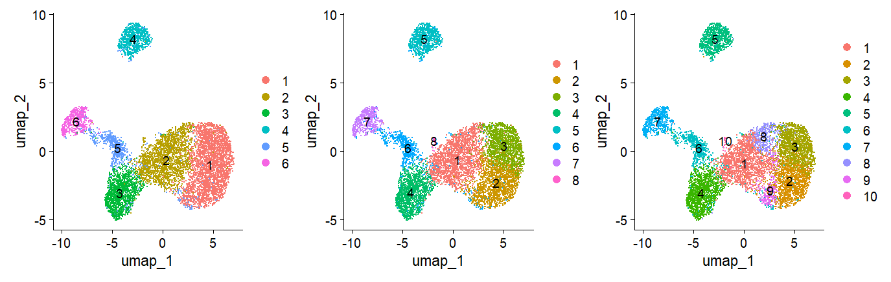

Do you see a pattern in the above graph? There is an increase in total
clusters with increase in resolution. For the simplicity of the analysis
we will use resolution of 0.4 to identify broad cell clusters.

7.  **Cell Marker Identification and Cell Annotation**

This analysis compares each cluster against all others and outputs the
genes that are differentially expressed using the FindAllMarkers()
function.

```r
 # When working with merged datasets, first we need to run this       
                                                                      
 merged_seurat <- PrepSCTFindMarkers(merged_seurat)                   
                                                                      
 # Find markers for every cluster compared to all remaining cells, report only the positive ones                                        
                                                                       
 cell_markers <- FindAllMarkers(merged_seurat, 
                                only.pos = TRUE,       
                                min.pct = 0.25, 
                                logfc.threshold = 0.25)                               
                                                                       
 # get the top 10 hits for each cluster                               
                                                                       
 top_cell_markers <- cell_markers %>% group_by(cluster) %>% slice_max(n = 20, order_by = avg_log2FC)                              
                                                                       
 view(top_cell_markers)                                                
```

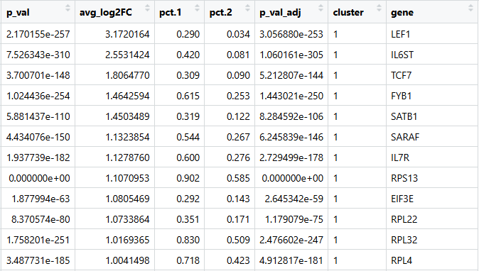

Now we have the top 20 marker genes for each cluster. Save this file in .csv format.

```r
  write.csv(top_cell_markers, file = "Cell_marker_genes.csv")
```

[DoHeatmap()](https://satijalab.org/seurat/reference/doheatmap)
generates an expression heatmap for given cells and features. In this
case, we are plotting the top 20 markers for each cluster.

```r
 #Plot top 20 marker genes for each cluster                            
                                                                       
 DoHeatmap(merged_seurat, features = top_cell_markers\$gene) + NoLegend()                                                            
```

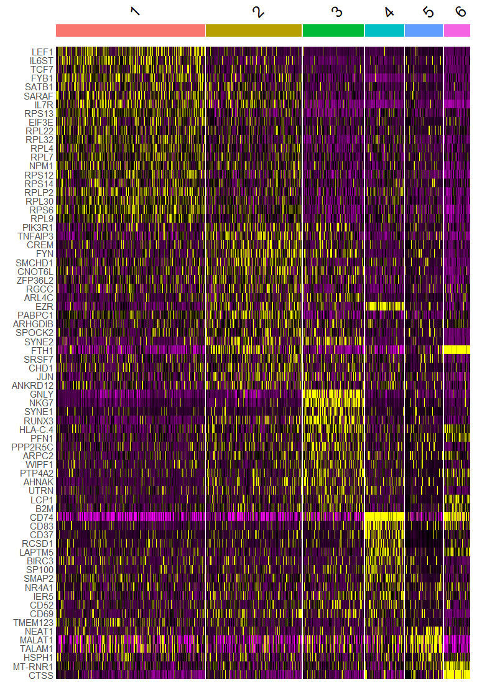

Public Databases for manual annotation:

-   PangloDB

-   Cell Marker 2.0

-   Automated Cell Annotation Tool:

-   Azimuth

-   CellAnnotator

Here, we manually annotate clusters using public databases based on top 20 marker genes and the result are as follows:

**Cluster 1 - Naive CD8+/CD4+ T Cell**

**Cluster 2 - Memory T Cell**

**Cluster 3 - Natural Killer Cell**

**Cluster 4 - B Cell**

**Cluster 5 - RBC**

**Cluster 6 - Dendritic Cell**

Based on the identified cell types, we look for the expression pattern
of already known marker genes for these cell types to double-verify our
annotation. For example marker genes for Natural Killer Cells are GNLY
and NKG7. Let us plot these genes in UMAP to see if its expression is
overlapping with cluster 3 or not.

```r
#Plotting marker genes for Natural Killer Cells                       
                                                                       
 FeaturePlot(merged_seurat,                                                                                            
 features = c("GNLY","NKG7"),                                      
 reduction = "umap",                                                 
 min.cutoff = "q10",                                                 
 label = TRUE)                                                         
```

From the above graph, now we are more confident that cluster 3 belongs
to natural killer cells. You can repeat the same for all other cell
types or alternatively can visualise the expression of marker genes
using DotPlot(). Before that let us rename our clusters with the new
cell types using RenameIdents() function.

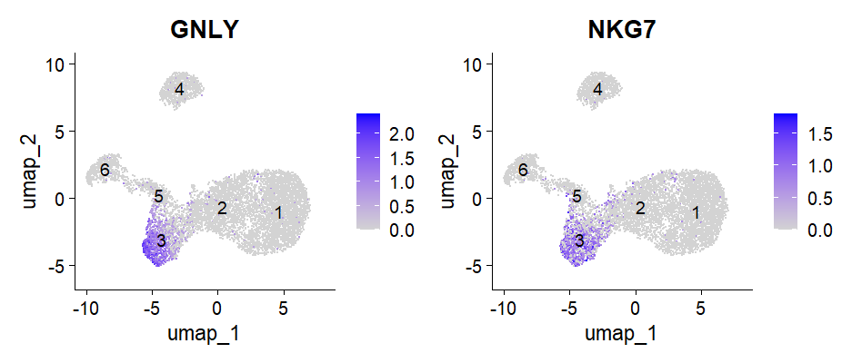

```r
 merged_seurat$CellType <- recode(merged_seurat$seurat_clusters,    
                                                                    
 "1" = "Naive T cell",                                             
                                                                   
 "2" = "Memory T cell",                                            
                                                                   
 "3" = "Natural Killer cell",                                      
                                                                   
 "4" = "B cell",                                                   
                                                                   
 "5" = "RBC",                                                      
                                                                   
 "6" = "Dendritic cell")                                           
                                                                   
 Idents(merged_seurat) <- "CellType"                               
                                                                   
 #Plotting known marker genes for identified 6 cell types          
                                                                   
 DotPlot(merged_seurat, features = 
                         c("CST3","THBD","HLA-DRB1","HBB","HBA1","HBA2","MS4A1","CD79A","GNLY",
                         "NKG7","GZMB","IL7R","PTPRC","LEF1","SELL","TCF7"), 
                         cols = c("lightgrey", "red")) +                                   
  RotatedAxis()                                                         
```

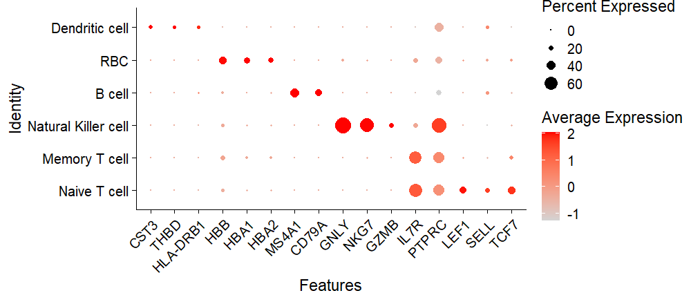

```r
 #Plotting final UMAP after cell annotation                            
                                                                       
 DimPlot(merged_seurat, reduction = "umap", label = TRUE)            
```

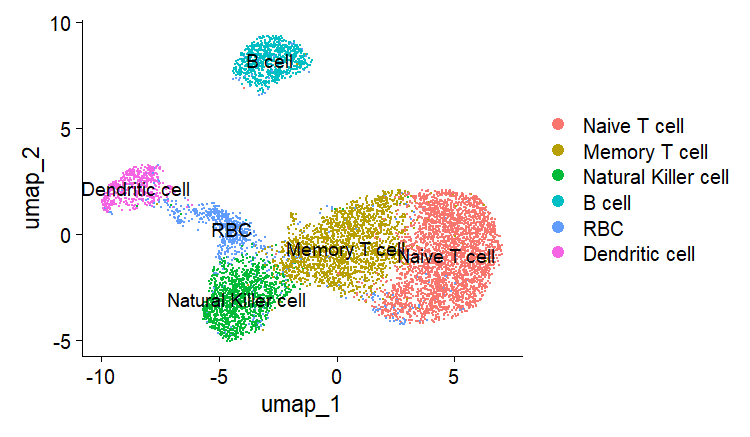

Save the final labelled Seurat object:

```r
  saveRDS(merged_seurat,"E:/3rd_INDO-VIETNAM_WORKSHOP/Results/Labelled_seurat-object.rds")
```

8.  **Differential Expression Analysis**

Differential expression (DE) analysis identifies genes that are
expressed at significantly different levels between two groups of cells,
such as:

-   Between clusters (cell types)

-   Between conditions (Healthy vs Infected)

-   Within a cluster across conditions( e.g Natural Killer cell : Healthy vs Infected)

While doing cell annotation we already performed differential expression
analysis between clusters(cell types) using FindallMarkers() function.
Now we will do differential expression between conditions (i.e. Healthy
vs Infected) using FindMarkers() function. Before that we need to add
condition information to our meta.data:

```r
 merged_seurat$Condition <- ifelse(                                  
                                                                     
 merged_seurat$orig.ident %in% c("b08st05", "b08st06"),"Infected","Healthy")                                                       
                                                                  
 table(merged_seurat@meta.data$Condition)                         
```

```r
 Healthy Infected
            
 7091 1426                                                   
```

-   Differential expression between condition using FindMarkers():

```r
 Idents(merged_seurat) <- "Condition"                               
                                                                    
 de_global <- FindMarkers(merged_seurat,                                                     
                          ident.1 = "Infected",                                              
                          ident.2 = "Healthy",                                               
                          logfc.threshold = 0.25,                                            
                          min.pct = 0.1,                                                     
                          test.use = "wilcox")                                               
 head(de_global)                                                    
```

```r
p_val avg_log2FC pct.1 pct.2 p_val_adj
                                                                      
HBB 0.000000e+00 15.297899 0.869 0.000 0.000000e+00                                                                      
HBA1 0.000000e+00 13.231387 0.410 0.000 0.000000e+00                                                                       
HBA2 0.000000e+00 13.002265 0.379 0.000 0.000000e+00                                                                       
MT-CO3 5.215769e-286 -1.655461 0.432 0.851 7.346933e-282                                                                       
MT-CO1 6.328071e-229 -1.433914 0.555 0.883 8.913721e-225                                                                      
MT-CYB 1.559886e-204 -1.093052 0.680 0.925 2.197256e-200
```

It compares two groups of cells and returns:

-   **avg_log2FC** → average log2 fold change

-   **p_val** → raw p-value

-   **p_val_adj** → FDR-adjusted p-value

-   **pct.1 / pct.2** → percentage of cells expressing the gene in each condition

**Note:** *This method compares all healthy cells with all infected
cells and ignores cell-type specific differences and hence is not
biologically informative; however, it can detect condition driven
differential expression.*

For cell-type specific DE you can subset Seurat object based on cluster
name and then can use FindMarkers() function for comparison between
conditions. Here is an example for Natural Killer cell:

```r
| Idents(merged_seurat) <- "CellType"                                
|                                                                    
| levels(Idents(merged_seurat))                                      
```

```r
[1] "Naive T cell" "Memory T cell" "Natural Killer cell" "B cell"
[5] "RBC" "Dendritic cell"                          
```

Subset cluster followed by DE within cluster:

```r
 #Subset cluster                                                       
                                                                       
 NK <- subset(merged_seurat, idents = "Natural Killer cell")        
                                                                       
 # Set identity to Group                                              
                                                                       
 Idents(NK) <- "Condition"                                          
                                                                       
 NK <- PrepSCTFindMarkers(NK)                                         
                                                                       
 NK_cluster <- FindMarkers(NK,                                        
                           ident.1 = "Infected",                                               
                           ident.2 = "Healthy",                                                
                           logfc.threshold = 0.25,                                               
                           min.pct = 0.1,                                                        
                           test.use = "wilcox"                                                 
)                                                                     
```

The top 10 DE genes in Healthy vs Infected Natural Killer cells:

In Seurat default differential expression, each cell is treated as a
separate observation which can inflate p-values. Hence it is recommended
to do pseudobulk analysis.

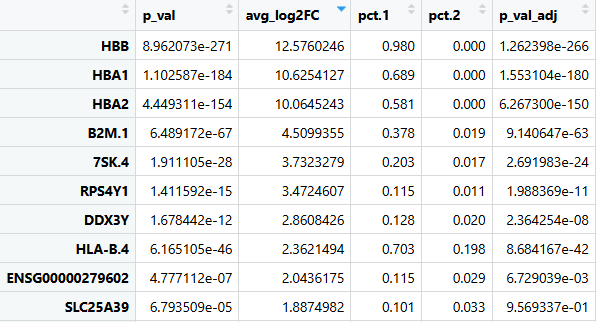

-   **Pseudobulk Analysis**

Pseudobulk analysis aggregates single-cell RNA-seq data (counts) by
summing or averaging gene expression within defined cell clusters for
each biological sample. This technique creates \"bulk-like\" profiles,
allowing for robust differential expression analysis using established
tools (DESeq2, edgeR) while retaining single-cell resolution for
identifying cell types.

```r
 #pseudobulk analysis                                                  
                                                                       
 pseudo <- AggregateExpression(NK,                                     
                               group.by = "orig.ident",                
                               assays = "RNA",                         
                               slot = "counts"                         
                               )                                       
                                                                       
 #countData                                                            
 counts <- pseudo$RNA                                                
                                                                     
 #colData                                                            
 sample_info <- data.frame(row.names = colnames(counts),             
                           Condition = ifelse(colnames(counts) %in%  
                           c("b08st05","b08st06"),"Infected","Healthy")                                                                   
 )                                                                     
                                                                       
 #Load DESeq2 library                                                  
                                                                       
 library("DESeq2")                                                     
                                                                       
 #Create DESeq object                                                  
                                                                       
 dds <- DESeqDataSetFromMatrix(countData = counts,                                                   
                               colData = sample_info,                                                
                               design = ~ Condition                                                 
                             )                                                                     
                                                                       
 dds <- DESeq(dds)                                                    
                                                                       
 #Save results                                                                                                                           
 res <- results(dds)                                                  
```

The top 10 DE genes in Healthy vs Infected Natural Killer
cells: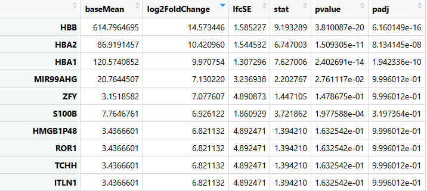

Do you find any differences between the results from Seurat DE and
Pseudobulk analysis ?


